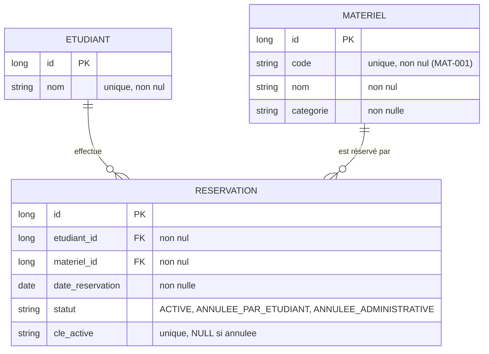
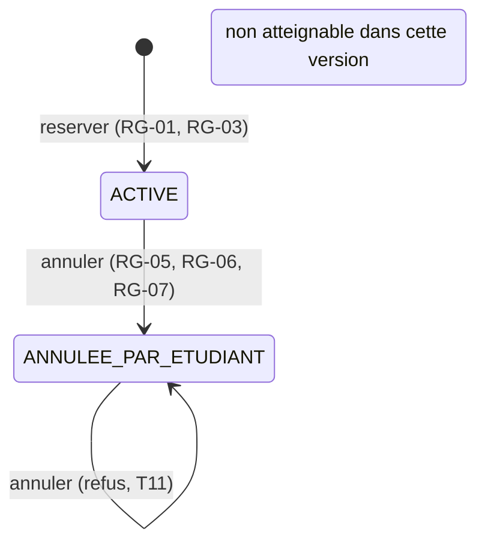

# Modèle de données : Réservation de matériel pédagogique

**Fonctionnalité** : `001-reservation-materiel` | **Date** : 2026-09-16

**Entrée** : spécification [spec.md](./spec.md), décisions techniques [research.md](./research.md)

---

## Vue d'ensemble

---

## Entité `Etudiant`

Un étudiant fictif autorisé à emprunter du matériel.

| Attribut | Type | Contraintes | Rôle |
|---|---|---|---|
| `id` | `Long` | Clé primaire, générée | Identifiant technique |
| `nom` | `String` | Non nul, unique, 1 à 100 caractères | Nom affiché de l'étudiant |

**Justification des contraintes** : l'unicité du nom assure que l'initialiseur reste idempotent
(R-05) : c'est la clé métier utilisée pour vérifier l'existence avant insertion.

**Données initiales** : Alice Martin, Bilal Dupont, Chloé Bernard.

**Exigences couvertes** : FR-001, FR-002, FR-009.

---

## Entité `Materiel`

Un **exemplaire physique unique** d'équipement. Deux ordinateurs identiques sont deux
enregistrements distincts (FR-023, RG-01).

| Attribut | Type | Contraintes | Rôle |
|---|---|---|---|
| `id` | `Long` | Clé primaire, générée | Identifiant technique |
| `code` | `String` | Non nul, unique, 1 à 20 caractères | Identifiant métier affiché (`MAT-001`) |
| `nom` | `String` | Non nul, 1 à 100 caractères | Libellé (`Ordinateur portable A`) |
| `categorie` | `String` | Non nul, 1 à 50 caractères | Famille (`Informatique`, `Projection`, `Électronique`) |

**Justification** : l'unicité de `code` est la clé métier de l'initialiseur et garantit qu'un
exemplaire physique n'est jamais créé deux fois (FR-023). Aucune quantité n'est stockée : la
quantité disponible est **déduite** des réservations, jamais copiée dans cette entité. Stocker un
compteur de disponibilité créerait une seconde source de vérité, susceptible de diverger.

**Données initiales** :

| `code` | `nom` | `categorie` |
|---|---|---|
| MAT-001 | Ordinateur portable A | Informatique |
| MAT-002 | Ordinateur portable B | Informatique |
| MAT-003 | Vidéoprojecteur A | Projection |
| MAT-004 | Kit Arduino A | Électronique |
| MAT-005 | Kit Arduino B | Électronique |

**Exigences couvertes** : FR-003, FR-018, FR-023.

---

## Entité `Reservation`

L'occupation d'un matériel par un étudiant à une date donnée.

| Attribut | Type | Contraintes | Rôle |
|---|---|---|---|
| `id` | `Long` | Clé primaire, générée | Identifiant technique |
| `etudiant` | `Etudiant` | Relation `@ManyToOne` obligatoire | Propriétaire de la réservation |
| `materiel` | `Materiel` | Relation `@ManyToOne` obligatoire | Matériel réservé |
| `dateReservation` | `LocalDate` | Non nul | **Journée** réservée (pas de créneau horaire) |
| `statut` | `StatutReservation` | Non nul, stocké en chaîne (`@Enumerated(EnumType.STRING)`) | État de la réservation |
| `cleActive` | `String` | **Unique**, `NULL` si la réservation n'est pas active | Colonne technique garantissant l'absence de doublon actif |

**Choix de `LocalDate`** : la réservation porte sur une journée entière, conformément à
l'hypothèse H-01 et aux exclusions du périmètre (pas de réservation par créneau horaire). Un
`LocalDateTime` serait plus complexe et n'apporterait rien.

**Choix de `@Enumerated(EnumType.STRING)`** : le statut est lisible directement dans la base et
reste stable si l'ordre des valeurs de l'énumération change. Un stockage par ordinal rendrait la
base dépendante de l'ordre de déclaration.

**Aucune contrainte d'unicité sur (materiel, dateReservation)** : elle empêcherait une nouvelle
réservation après une annulation, ce qui violerait RG-07 et ferait échouer le scénario T07.
Voir R-01 dans [research.md](./research.md).

**Exigences couvertes** : FR-005 à FR-008, FR-011 à FR-016, FR-020, FR-021, FR-025 à FR-027.

---

## Statuts et transitions

| Statut | Signification | Atteignable par l'application |
|---|---|---|
| `ACTIVE` | La réservation occupe le matériel à sa date | Oui |
| `ANNULEE_PAR_ETUDIANT` | L'étudiant propriétaire a annulé | Oui |
| `ANNULEE_ADMINISTRATIVE` | Annulation décidée hors application | **Non** (FR-027) |

**Règles de transition** :

| Transition | Autorisée si | Refus sinon | Exigences |
|---|---|---|---|
| Réserver | date ≥ aujourd'hui **et** pas de réservation active sur (matériel, date) | Refus, aucune écriture | FR-005 à FR-008, FR-016, FR-021 |
| Annuler depuis `ACTIVE` | demandeur = propriétaire **et** aujourd'hui ≤ date réservée | Refus, aucune écriture | FR-010 à FR-012 |
| Annuler depuis un état annulé | Jamais | Refus, aucune écriture, message indiquant l'état | CL-01, FR-013, FR-016 |

**Le statut ne revient jamais en arrière.** Aucune transition ne ramène une réservation annulée
vers `ACTIVE` : une nouvelle réservation crée un **nouvel enregistrement**. Cette règle est ce
qui permet à RG-07 (« conserver l'historique ») et à T07 (« disponibilité après annulation »)
d'être satisfaits simultanément.

---

## Colonne technique `cleActive`

### Rôle

Garantir au niveau de la base qu'il ne peut exister qu'**une seule réservation active** pour un
couple (matériel, date), même si deux demandes arrivent simultanément (CL-07, T12).

### Valeur

| Situation | Valeur de `cleActive` |
|---|---|
| Réservation active | `<code du matériel>|<date>` — par exemple `MAT-001\|2030-03-12` |
| Réservation annulée (toutes origines) | `NULL` |

### Fonctionnement

- Un index unique autorise **plusieurs valeurs `NULL`** (comportement SQL standard, appliqué par
  H2). Plusieurs réservations annulées pour le même couple (matériel, date) peuvent donc
  coexister, ce qui est nécessaire à RG-07.
- Une seule ligne **active** peut porter une valeur donnée. Une seconde insertion concurrente est
  rejetée par la base.
- L'annulation remet `cleActive` à `NULL`, ce qui libère immédiatement le couple (RG-07, FR-014)
  et permet une nouvelle réservation (T07).

### Traitement de l'erreur

Une violation de la contrainte est interceptée et traduite en erreur métier avec le code
`MATERIEL_INDISPONIBLE`, puis affichée comme un message compréhensible (RG-09). Aucune erreur
technique n'est présentée à l'utilisateur.

### Justification du caractère « technique »

Cette colonne n'est **pas** une donnée métier : elle ne figure dans aucune page, n'est jamais
affichée et n'est jamais lue pour décider d'une règle. Elle est redondante avec le statut, par
construction. Elle est documentée ici parce qu'elle est indispensable au respect de RG-02 sous
concurrence.

---

## Règles de validation

### Validation du formulaire (Jakarta Validation, `ReservationForm`)

| Champ | Contrainte | Message |
|---|---|---|
| `dateReservation` | `@NotNull` | « La date de réservation est obligatoire. » |
| `materielId` | `@NotNull` | « Le matériel est obligatoire. » |

Le format de la date est validé par le mécanisme de conversion ; une date illisible produit une
erreur de saisie, pas une erreur technique (CL-03, T10).

### Validation contextuelle (dans `ReservationService`)

Ces contrôles dépendent de l'état des données et ne peuvent pas être portés par des annotations
de champ.

| Contrôle | Code de refus | Exigence |
|---|---|---|
| Date antérieure à `LocalDate.now(clock)` | `DATE_PASSEE` | FR-007 |
| Aucun étudiant courant défini | `ETUDIANT_NON_SELECTIONNE` | FR-017 |
| Matériel inexistant | `MATERIEL_INCONNU` | FR-018 |
| Réservation active déjà existante sur (matériel, date) par un autre étudiant | `MATERIEL_INDISPONIBLE` | FR-006 |
| Réservation active déjà existante sur (matériel, date) par l'étudiant courant | `DEJA_RESERVE_PAR_VOUS` | FR-025 |
| L'étudiant détient déjà deux réservations actives à cette date | `LIMITE_RESERVATIONS_JOUR` | FR-028 |
| Réservation inexistante | `RESERVATION_INTROUVABLE` | FR-020 |
| Demandeur non propriétaire | `PAS_PROPRIETAIRE` | FR-010 |
| Jour réservé déjà passé | `JOUR_RESERVE_PASSE` | FR-012 |
| Réservation déjà annulée | `DEJA_ANNULEE` | CL-01, FR-013 |

**Ordre des contrôles à la réservation** : date → étudiant courant → matériel → conflit → limite.
Le conflit est examiné **avant** la limite : si le matériel est déjà occupé, annoncer la limite
atteinte inciterait l'étudiant à annuler une réservation sans que cela débloque sa demande. Cet
ordre garantit aussi que le message affiché reste stable dans les tests.

**Ordre des contrôles à l'annulation** : existence → propriétaire → état déjà annulé → date. Le
contrôle du **propriétaire précède** celui de l'état : un étudiant qui tente d'annuler la
réservation annulée d'un autre doit recevoir un refus pour non-propriété, sans apprendre l'état
de la réservation d'autrui.

---

## Requêtes d'accès aux données

| Besoin | Méthode | Exigence |
|---|---|---|
| Vérifier l'existence d'un conflit actif | `existsByMaterielIdAndDateReservationAndStatut(Long, LocalDate, StatutReservation)` | FR-004, FR-021 |
| Retrouver la réservation active d'un étudiant | `findByMaterielIdAndDateReservationAndStatutAndEtudiantId(...)` | FR-025 |
| Lister les réservations d'un étudiant | `findByEtudiantIdOrderByDateReservationDesc(Long)` | FR-009 |
| Compter les réservations actives d'un couple (matériel, date) | `countByMaterielIdAndDateReservationAndStatut(...)` | vérification de T02 et T12 |
| Compter les réservations actives d'un étudiant à une date | `countByEtudiantIdAndDateReservationAndStatut(...)` | FR-028 (limite de deux par jour) |

La méthode de comptage est **préparée mais non utilisée** dans cette version : elle sert à
l'étape d'évolution (limite de deux réservations actives par jour). Elle n'est appelée par aucune
règle de cette version.

**Note d'honnêteté** : cette méthode est du code non utilisé. Elle est signalée ici pour que le
relecteur ne la découvre pas avec surprise. Si le binôme préfère ne rien préparer, elle peut être
supprimée : l'étape d'évolution n'en a pas besoin pour démarrer.

---

## Traçabilité du modèle

| Élément du modèle | Exigences | Règles métier |
|---|---|---|
| `Etudiant` | FR-001, FR-002, FR-009 | — |
| `Materiel` | FR-003, FR-018, FR-023 | RG-01 |
| `Reservation` | FR-005 à FR-008, FR-011 à FR-016, FR-020, FR-025 à FR-027 | RG-01, RG-02, RG-07 |
| `Reservation.dateReservation` | FR-007, FR-011, FR-012, FR-019 | RG-03, RG-06 |
| `Reservation.statut` | FR-013, FR-026, FR-027 | RG-07 |
| `Reservation.cleActive` | FR-004, FR-006, FR-021 | RG-02 |
| Relation `Etudiant` → `Reservation` | FR-009, FR-010 | RG-05 |
| Relation `Materiel` → `Reservation` | FR-004, FR-023 | RG-02 |
