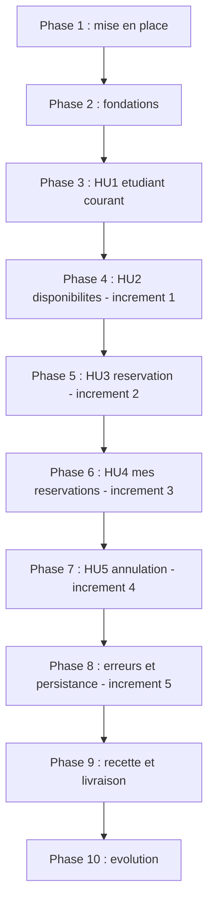

---

description: "Liste des tâches pour la réservation de matériel pédagogique"
---

# Tâches : Réservation de matériel pédagogique

**État au 16 septembre 2026** : **T001 à T045 terminées et vérifiées** (76 tests, aucun échec).
L'évolution du besoin (T042 à T045) a été appliquée après la recette, dans l'ordre imposé par
l'énoncé : documents d'abord, code ensuite.

**Entrée** : documents de conception de `specs/001-reservation-materiel/`

**Prérequis** : [plan.md](./plan.md), [spec.md](./spec.md), [research.md](./research.md),
[data-model.md](./data-model.md), [contracts/routes.md](./contracts/routes.md)

**Tests** : les tests sont **obligatoires** pour cette fonctionnalité. L'énoncé du TP impose les
tests automatiques T01 à T08 et T10 à T12 (section 13) et la constitution, principe IV, exige
qu'une règle métier soit couverte par une vérification exécutable.

## Format : `[ID] [P?] [Histoire] Description`

- **[P]** : peut être réalisé en parallèle (fichiers différents, aucune dépendance)
- **[Histoire]** : histoire utilisateur concernée (HU1 à HU5)
- Chaque tâche indique son **résultat concret**, ses **dépendances** et sa **vérification**,
  conformément à la section 11 de l'énoncé.

## Correspondance avec les incréments imposés par l'énoncé

| Incrément (énoncé, section 12) | Phases correspondantes |
|---|---|
| 1. Consultation du matériel | Phases 1, 2 et 4 |
| 2. Création d'une réservation | Phase 5 (après la phase 3, qui fournit l'étudiant courant) |
| 3. Consultation des réservations personnelles | Phase 6 |
| 4. Annulation | Phase 7 |
| 5. Erreurs et persistance | Phase 8 |

---

## Phase 1 — Mise en place

**Objet** : structure du projet et outillage.

- [x] **T001** Créer l'arborescence de paquets de `src/main/java/com/campus/campusmateriel/` : `config`, `controller`, `domain`, `dto`, `repository`, `service`, `session`
  - **Résultat** : les paquets existent, le projet compile
  - **Dépend de** : rien (le squelette Spring Boot est en place)
  - **Vérification** : `.\mvnw.cmd test` réussit
  - **Exigences** : —

- [x] **T002** [P] Créer le gabarit de mise en page Thymeleaf `src/main/resources/templates/fragments/layout.html` et la feuille de style `src/main/resources/static/style.css`
  - **Résultat** : en-tête commun, navigation entre les pages, libellés en français, formulaires utilisables au clavier
  - **Dépend de** : T001
  - **Vérification** : une page de test s'affiche et la navigation clavier atteint tous les champs
  - **Exigences** : constitution (principes I et VI)

---

## Phase 2 — Fondations (bloquantes)

**Objet** : socle commun à toutes les histoires. **Aucune histoire ne peut démarrer avant la fin
de cette phase.**

- [x] **T003** [P] Créer l'entité `Etudiant` dans `src/main/java/com/campus/campusmateriel/domain/Etudiant.java` (`id`, `nom` unique et non nul)
  - **Résultat** : l'entité est persistée avec sa contrainte d'unicité sur le nom
  - **Dépend de** : T001
  - **Vérification** : le schéma est créé au démarrage ; deux étudiants de même nom sont refusés
  - **Exigences** : FR-001, FR-023 · [data-model.md](./data-model.md)

- [x] **T004** [P] Créer l'entité `Materiel` dans `domain/Materiel.java` (`id`, `code` unique, `nom`, `categorie`)
  - **Résultat** : l'entité est persistée avec sa contrainte d'unicité sur `code`
  - **Dépend de** : T001
  - **Vérification** : deux matériels de même `code` sont refusés
  - **Exigences** : FR-003, FR-023

- [x] **T005** [P] Créer l'énumération `StatutReservation` dans `domain/StatutReservation.java` avec `ACTIVE`, `ANNULEE_PAR_ETUDIANT`, `ANNULEE_ADMINISTRATIVE`
  - **Résultat** : les trois valeurs existent et sont stockées en chaîne
  - **Dépend de** : T001
  - **Vérification** : la colonne `statut` contient le libellé et non un ordinal
  - **Exigences** : FR-026 · décision CA-02

- [x] **T006** Créer l'entité `Reservation` dans `domain/Reservation.java` : relations `@ManyToOne` obligatoires vers `Etudiant` et `Materiel`, `dateReservation` en `LocalDate`, `statut` en `EnumType.STRING`, colonne technique `cleActive` **unique** et nulle lorsque la réservation n'est pas active
  - **Résultat** : l'entité est persistée avec la contrainte d'unicité sur `cleActive`
  - **Dépend de** : T003, T004, T005
  - **Vérification** : deux réservations actives sur le même couple (matériel, date) sont refusées par la base ; deux réservations annulées sur ce couple sont acceptées
  - **Exigences** : FR-004, FR-006, FR-021 · [research.md](./research.md) R-01

- [x] **T007** [P] Créer les interfaces `EtudiantRepository`, `MaterielRepository` et `ReservationRepository` dans `repository/`
  - **Résultat** : les méthodes de recherche du modèle de données sont déclarées
  - **Dépend de** : T003, T004, T006
  - **Vérification** : le contexte Spring démarre et les requêtes dérivées sont valides
  - **Exigences** : FR-004, FR-009, FR-025

- [x] **T008** Créer `config/ClockConfiguration.java` exposant un bean `Clock` (`Clock.systemDefaultZone()`)
  - **Résultat** : une horloge injectable est disponible dans toute l'application
  - **Dépend de** : T001
  - **Vérification** : un test injectant une `Clock` fixe obtient la date fixée
  - **Exigences** : FR-024 · R-02

- [x] **T009** Créer `config/DonneesDemoInitialiseur.java` : insertion **idempotente** des 3 étudiants et des 5 matériels, avec vérification d'existence par identifiant métier ; aucune suppression de réservation
  - **Résultat** : au premier lancement les données fictives existent ; aux lancements suivants elles ne sont pas dupliquées
  - **Dépend de** : T003, T004, T007
  - **Vérification** : lancer l'application deux fois de suite et compter les lignes : 3 étudiants, 5 matériels, aucune duplication
  - **Exigences** : FR-001, FR-015, FR-023 · R-05 · T09

- [x] **T010** Créer `service/RegleMetierException.java` (code de refus) et le composant unique de traduction des codes en messages français
  - **Résultat** : chaque code produit un message français, sans terme technique
  - **Dépend de** : T001
  - **Vérification** : un test vérifie qu'un code connu produit un message non vide et dépourvu de terme technique
  - **Exigences** : FR-016, FR-022 · [contracts/messages.md](./contracts/messages.md) · R-07

---

## Phase 3 — HU1 : choisir l'étudiant courant (P1)

**Objectif** : permettre de désigner l'étudiant au nom duquel les actions seront effectuées.

**Test indépendant** : sélectionner Alice, vérifier l'affichage ; sélectionner Bilal, vérifier le
changement.

- [x] **T011** [HU1] Implémenter `service/EtudiantCourantService.java` : lecture et écriture de l'identifiant de l'étudiant courant en session, et détection de l'absence de sélection
  - **Résultat** : l'identifiant de l'étudiant courant est lisible et modifiable, ou absent
  - **Dépend de** : T007, T010
  - **Vérification** : après écriture puis relecture, l'identifiant est identique ; sans écriture, l'absence est signalée
  - **Exigences** : FR-001, FR-002, FR-017 · R-06

- [x] **T012** [HU1] Implémenter `controller/EtudiantController.java` : `GET /etudiants/selection` affiche les étudiants, `POST /etudiants/selection` mémorise l'étudiant courant puis redirige
  - **Résultat** : les deux routes répondent conformément au contrat
  - **Dépend de** : T011, T002
  - **Vérification** : `GET` renvoie 200 avec les trois étudiants ; `POST` renvoie 302 puis l'étudiant courant a changé
  - **Exigences** : FR-001, FR-002 · [contracts/routes.md](./contracts/routes.md)

- [x] **T013** [P] [HU1] Créer la page `templates/etudiants/selection.html`
  - **Résultat** : les trois étudiants sont proposés, l'étudiant courant est identifié
  - **Dépend de** : T002, T012
  - **Vérification** : la page s'affiche, la navigation clavier atteint la liste et le bouton
  - **Exigences** : FR-001

- [x] **T014** [P] [HU1] Écrire les tests de la sélection dans `src/test/java/com/campus/campusmateriel/controller/EtudiantControllerTest.java`
  - **Résultat** : les trois scénarios de l'histoire 1 sont couverts
  - **Dépend de** : T012, T013
  - **Vérification** : `.\mvnw.cmd test` passe ; chaque test cite son exigence
  - **Exigences** : FR-001, FR-002, FR-017

**Point de contrôle** : l'étudiant courant peut être choisi et persiste entre deux requêtes.

---

## Phase 4 — HU2 : consulter le matériel disponible (P1) — *incrément 1*

**Objectif** : afficher les équipements et leur disponibilité à une date.

**Test indépendant** : consulter une date sans réservation, puis une date avec une réservation
préparée, et comparer.

- [x] **T015** [HU2] Implémenter `service/ReservationService.estDisponible(Long materielId, LocalDate date)` : un matériel est indisponible s'il existe une réservation **active** pour ce couple ; les réservations annulées ne bloquent pas
  - **Résultat** : la disponibilité est calculée à partir des réservations actives uniquement
  - **Dépend de** : T006, T007
  - **Vérification** : test — avec une réservation active la méthode renvoie « indisponible » ; la même réservation annulée, elle renvoie « disponible »
  - **Exigences** : FR-003, FR-004, FR-014 · RG-02, RG-07 · T02, T07

- [x] **T016** [HU2] Implémenter `controller/MaterielController.java` : `GET /materiels?date=…` — date absente ⇒ date courante, date illisible ⇒ message explicite sans erreur technique — et `GET /` qui redirige
  - **Résultat** : la page des disponibilités affiche les cinq matériels et leur état
  - **Dépend de** : T015, T008, T010
  - **Vérification** : `GET /materiels` renvoie 200 avec 5 lignes ; `GET /materiels?date=zzz` renvoie 200 avec un message et **sans** trace d'exécution
  - **Exigences** : FR-003, FR-016, FR-019, FR-022 · T10 · contrat `routes.md`

- [x] **T017** [P] [HU2] Créer la page `templates/materiels/liste.html`
  - **Résultat** : chaque matériel affiche code, nom, catégorie et « Disponible » ou « Réservé » ; aucun nom d'autre étudiant n'apparaît
  - **Dépend de** : T002, T016
  - **Vérification** : affichage conforme ; message d'état vide lorsque la liste est vide
  - **Exigences** : FR-003, FR-022 · contrat `messages.md`

- [x] **T018** [P] [HU2] Écrire les tests de disponibilité dans `src/test/java/com/campus/campusmateriel/service/ReservationServiceDisponibiliteTest.java`
  - **Résultat** : disponibilité sans réservation, avec réservation active, avec réservation annulée, et à une autre date
  - **Dépend de** : T015
  - **Vérification** : `.\mvnw.cmd test` passe avec une `Clock` fixée au 10 mars 2030
  - **Exigences** : FR-003, FR-004 · T07

**Point de contrôle (incrément 1)** : l'application démarre, affiche les cinq matériels et leur
disponibilité, et gère une date invalide sans erreur technique. **S'arrêter ici et vérifier
avant de passer à la réservation.**

---

## Phase 5 — HU3 : réserver un équipement (P1) — *incrément 2*

**Objectif** : créer une réservation pour l'étudiant courant, en refusant tous les cas invalides.

**Test indépendant** : réserver un matériel libre pour une date future, puis tenter une double
réservation et une date passée.

- [x] **T019** [P] [HU3] Créer le formulaire `dto/ReservationForm.java` avec les contraintes de validation (`dateReservation` obligatoire, `materielId` obligatoire) — **sans** champ d'identifiant d'étudiant
  - **Résultat** : le formulaire ne peut pas transporter de propriétaire
  - **Dépend de** : T001
  - **Vérification** : la classe ne comporte aucun champ d'étudiant
  - **Exigences** : FR-016, FR-019 · R-06

- [x] **T020** [HU3] Implémenter `ReservationService.reserver(...)` dans une transaction : date ≥ aujourd'hui, étudiant courant présent, matériel existant, puis détection de conflit en distinguant `DEJA_RESERVE_PAR_VOUS` de `MATERIEL_INDISPONIBLE` ; remplir `cleActive` ; traduire une violation de contrainte en `MATERIEL_INDISPONIBLE`
  - **Résultat** : une réservation valide est créée ; tout cas invalide est refusé **sans écriture**
  - **Dépend de** : T006, T010, T015, T019
  - **Vérification** : tests des cas autorisés et de chaque cas de refus, dans **l'ordre documenté** date → étudiant → matériel → conflit
  - **Exigences** : FR-005, FR-006, FR-007, FR-008, FR-016 à FR-019, FR-021, FR-025 · RG-01 à RG-04, RG-09 · T01, T02, T03, T04, T05, T10, T12

- [x] **T021** [HU3] Implémenter `POST /reservations` dans `controller/ReservationController.java` : appel du service, message de confirmation, redirection après succès, réaffichage avec message en cas de refus
  - **Résultat** : la route respecte le contrat, y compris l'ignorance d'un `etudiantId` injecté par le client
  - **Dépend de** : T020, T011
  - **Vérification** : `POST` valide ⇒ 302 ; `POST` invalide ⇒ 200 avec message et **aucune** ligne créée ; un `etudiantId` forgé est ignoré
  - **Exigences** : FR-005, FR-016, FR-017 · contrat `routes.md`

- [x] **T022** [P] [HU3] Écrire les tests de création dans `src/test/java/com/campus/campusmateriel/service/ReservationServiceReservationTest.java` et `.../controller/ReservationCreationTest.java`
  - **Résultat** : T01 à T05, T10 et T12 couverts par des tests automatisés
  - **Dépend de** : T020, T021
  - **Vérification** : `.\mvnw.cmd test` passe ; chaque test cite son scénario T0x et son exigence
  - **Exigences** : FR-005 à FR-008, FR-016, FR-019, FR-021, FR-025 · T01 à T05, T10, T12

- [x] **T023** [P] [HU3] Créer la page `templates/reservations/nouvelle.html` (formulaire de réservation intégré à la liste des matériels)
  - **Résultat** : le formulaire poste vers `/reservations` avec la date et le matériel uniquement
  - **Dépend de** : T002, T021
  - **Vérification** : le formulaire est utilisable au clavier et n'expose aucun champ d'étudiant
  - **Exigences** : FR-005 · constitution (principe VI)

**Point de contrôle (incrément 2)** : une réservation valide est créée et apparaît comme telle ;
une double réservation et une date passée sont refusées sans écriture.

---

## Phase 6 — HU4 : consulter ses réservations (P2) — *incrément 3*

**Objectif** : afficher les réservations de l'étudiant courant, annulées comprises.

**Test indépendant** : Alice a deux réservations, Bilal une ; Alice ne voit que les siennes.

- [x] **T024** [HU4] Implémenter `ReservationService.reservationsDe(Long etudiantId)` : liste des réservations de l'étudiant, triées par date décroissante, annulées comprises
  - **Résultat** : la liste ne contient que les réservations de l'étudiant demandé
  - **Dépend de** : T006, T007
  - **Vérification** : test — Alice voit ses deux réservations et aucune de Bilal ; une réservation annulée reste présente
  - **Exigences** : FR-009, FR-013 · RG-05, RG-07

- [x] **T025** [HU4] Implémenter `GET /reservations` dans `controller/ReservationController.java` : filtrage par l'étudiant courant issu de la session ; invitation à choisir un étudiant si aucune sélection ; message explicite si la liste est vide
  - **Résultat** : la route respecte le contrat
  - **Dépend de** : T024, T011
  - **Vérification** : `GET` avec étudiant courant ⇒ 200 ; sans étudiant courant ⇒ invitation à choisir, **sans** erreur technique
  - **Exigences** : FR-009, FR-017, FR-022 · contrat `routes.md`

- [x] **T026** [P] [HU4] Créer la page `templates/reservations/liste.html` : matériel, date, état (« Active » / « Annulée ») et action d'annulation lorsque celle-ci est possible
  - **Résultat** : l'état de chaque réservation est visible ; l'action d'annulation n'est proposée que si elle est autorisée
  - **Dépend de** : T002, T025
  - **Vérification** : affichage conforme au contrat des messages
  - **Exigences** : FR-009, FR-013, FR-022 · contrat `messages.md`

- [x] **T027** [P] [HU4] Écrire les tests de consultation dans `src/test/java/com/campus/campusmateriel/controller/ReservationListeTest.java`
  - **Résultat** : les quatre scénarios de l'histoire 4 sont couverts
  - **Dépend de** : T025, T026
  - **Vérification** : `.\mvnw.cmd test` passe
  - **Exigences** : FR-009, FR-013, FR-022

**Point de contrôle (incrément 3)** : l'étudiant courant voit exactement ses réservations, avec
leur état, et les annulées restent visibles.

---

## Phase 7 — HU5 : annuler une réservation (P2) — *incrément 4*

**Objectif** : annuler une réservation autorisée, refuser tous les autres cas, conserver
l'historique.

**Test indépendant** : créer, annuler, vérifier l'état et la disponibilité retrouvée.

- [x] **T028** [HU5] Implémenter `ReservationService.annuler(Long reservationId, Long etudiantId)` dans une transaction, dans **l'ordre** existence → propriétaire → déjà annulée → date : refus si non propriétaire, refus si jour réservé passé, refus sans modification si déjà annulée ; sinon statut `ANNULEE_PAR_ETUDIANT` et `cleActive` remise à `NULL`
  - **Résultat** : l'annulation libère le matériel, conserve l'enregistrement, et n'attribue jamais `ANNULEE_ADMINISTRATIVE`
  - **Dépend de** : T006, T010, T020
  - **Vérification** : tests de chaque cas, y compris l'ordre des contrôles et la réaffectation de `cleActive` à `NULL`
  - **Exigences** : FR-010 à FR-014, FR-016, FR-020, FR-026, FR-027 · RG-05, RG-06, RG-07, RG-09 · T06, T07, T08, T11

- [x] **T029** [HU5] Implémenter `POST /reservations/{id}/annulation` dans `controller/ReservationController.java`, **sans** accepter d'identifiant d'étudiant en paramètre
  - **Résultat** : la route respecte le contrat ; le propriétaire provient uniquement de la session
  - **Dépend de** : T028, T011
  - **Vérification** : succès ⇒ 302 ; refus ⇒ 200 avec message et **aucune modification**
  - **Exigences** : FR-010, FR-011, FR-016 · contrat `routes.md`

- [x] **T030** [P] [HU5] Écrire les tests d'annulation dans `src/test/java/com/campus/campusmateriel/service/ReservationServiceAnnulationTest.java`
  - **Résultat** : T06, T07 et T11 couverts ; l'état obtenu est bien `ANNULEE_PAR_ETUDIANT`
  - **Dépend de** : T028
  - **Vérification** : `.\mvnw.cmd test` passe
  - **Exigences** : FR-010 à FR-014, FR-020, FR-026, FR-027 · T06, T07, T11

- [x] **T031** [HU5] Écrire le test de refus par **requête directe au serveur** dans `src/test/java/com/campus/campusmateriel/controller/AnnulationNonProprietaireTest.java` : l'étudiant courant est Bilal, la réservation appartient à Alice, aucune interface n'est utilisée
  - **Résultat** : le refus tient sans passer par la page, et la réservation reste inchangée
  - **Dépend de** : T029
  - **Vérification** : le test échoue si le contrôle du propriétaire est retiré du service
  - **Exigences** : FR-010 · **T08** (exigence explicite de l'énoncé : masquer un bouton ne suffit pas)

**Point de contrôle (incrément 4)** : annulation autorisée, refus pour non-propriétaire y compris
par requête directe, matériel de nouveau disponible, historique conservé.

---

## Phase 8 — Erreurs et persistance — *incrément 5*

**Objectif** : couvrir systématiquement les entrées invalides et vérifier la persistance.

- [x] **T032** Vérifier et compléter le traitement des entrées invalides : date absente, date illisible, matériel inexistant, réservation inexistante, annulation non autorisée, liste vide — chaque cas produisant un message français et **aucune écriture**
  - **Résultat** : les cas CL-01 à CL-09 sont tous traités
  - **Dépend de** : T016, T021, T025, T029
  - **Vérification** : un test par cas limite, vérifiant le message **et** l'absence de modification des données
  - **Exigences** : FR-016, FR-018, FR-019, FR-020, FR-022 · RG-09 · CL-01 à CL-09 · T10, T11

- [x] **T033** Écrire le test du cas limite CL-07 (deux demandes sur le même couple) dans `src/test/java/com/campus/campusmateriel/persistence/ConflitConcurrentTest.java` : vérifier qu'au plus une réservation active subsiste, et que l'entité `Reservation` ne peut pas en enregistrer deux actives sur le même couple
  - **Résultat** : la protection de second niveau est prouvée par un test, pas seulement affirmée
  - **Dépend de** : T006, T020
  - **Vérification** : le test échoue si la colonne `cleActive` perd son unicité
  - **Exigences** : FR-021 · RG-02 · **T12**

- [x] **T034** [P] Écrire le test d'isolation des données : `src/test/java/com/campus/campusmateriel/persistence/DonneesDemoTest.java` vérifie que l'initialiseur est idempotent (exécuté deux fois, il ne duplique rien) et ne supprime aucune réservation
  - **Résultat** : l'idempotence de T009 est prouvée
  - **Dépend de** : T009
  - **Vérification** : après deux exécutions, 3 étudiants et 5 matériels exactement
  - **Exigences** : FR-015, FR-023 · R-05

- [x] **T035** Écrire le test garantissant qu'aucune annulation ne produit `ANNULEE_ADMINISTRATIVE`
  - **Résultat** : la borne posée par FR-027 est vérifiée
  - **Dépend de** : T028
  - **Vérification** : après toute annulation réalisable par l'application, le statut est `ANNULEE_PAR_ETUDIANT`
  - **Exigences** : FR-027 · décision CA-02

**Point de contrôle (incrément 5)** : toutes les entrées invalides sont traitées, la persistance
est vérifiée, et la limitation assumée de CA-02 est prouvée.

---

## Phase 9 — Recette, documentation et livraison

- [x] **T036** Exécuter la recette complète : tests automatisés T01 à T08 et T10 à T12, puis procédure manuelle T09 de [quickstart.md](./quickstart.md)
  - **Résultat** : un compte rendu par test, avec résultat obtenu, statut et anomalie éventuelle
  - **Dépend de** : T032 à T035
  - **Vérification** : `docs/compte-rendu-recette.md` complété, sans test déclaré réussi sans exécution
  - **Exigences** : SC-004 · section 13 de l'énoncé

- [x] **T037** [P] Créer la matrice de traçabilité `docs/matrice-tracabilite.md` : exigence → tâche → test → scénario de recette
  - **Résultat** : chaque RG-01 à RG-09 et chaque FR-001 à FR-027 est reliée à une tâche et à une vérification
  - **Dépend de** : T032 à T036
  - **Vérification** : aucune ligne sans vérification ; aucun scénario T01 à T12 orphelin
  - **Exigences** : SC-005 · livrable 5 de l'énoncé

- [x] **T038** [P] Mettre à jour `README.md` : versions, installation, lancement, tests, réinitialisation des données, limites
  - **Résultat** : un lecteur externe peut installer et lancer le projet sans aide
  - **Dépend de** : T036
  - **Vérification** : suivre le README depuis un dossier vierge ; chaque commande fonctionne
  - **Exigences** : livrable 1 de l'énoncé

- [x] **T039** [P] Compléter `docs/journal-decisions.md` avec les décisions prises pendant l'implémentation et les propositions de l'IA corrigées ou refusées
  - **Résultat** : au moins trois propositions corrigées, refusées ou précisées sont consignées
  - **Dépend de** : T036
  - **Vérification** : relecture du tableau des propositions
  - **Exigences** : livrable 6 de l'énoncé

- [x] **T040** Lancer `/speckit-analyze` et traiter les incohérences signalées entre spécification, plan et tâches
  - **Résultat** : aucune contradiction bloquante ne subsiste
  - **Dépend de** : T036 à T039
  - **Vérification** : rapport d'analyse sans incohérence bloquante
  - **Exigences** : Jalon 2 · section 11 de l'énoncé

- [x] **T041** Lancer `/speckit-converge` pour rechercher les écarts restants entre le code et la spécification, puis traiter les tâches ajoutées
  - **Résultat** : les écarts résiduels sont identifiés et traités
  - **Dépend de** : T040
  - **Vérification** : rapport de convergence
  - **Exigences** : section 13 de l'énoncé

---

## Phase 10 — Évolution du besoin (après la recette)

**Objet** : traiter la demande du département — « un étudiant ne peut pas avoir plus de deux
réservations actives pour une même journée ». **Cette phase ne démarre qu'après la recette.**

- [x] **T042** Reformuler RG-04 dans `docs/enonce.md` et `spec.md` en intégrant la limite, **sans conserver** les deux formulations ; ajouter les exigences et critères d'acceptation correspondants
  - **Résultat** : une seule formulation de RG-04, cohérente
  - **Dépend de** : T036
  - **Vérification** : recherche de « RG-04 » dans les documents : aucune version contradictoire
  - **Exigences** : section 14 de l'énoncé

- [x] **T043** Mettre à jour le plan, les tâches et le modèle de données pour la nouvelle règle ; relancer l'analyse de cohérence
  - **Résultat** : plan, tâches et modèle reflètent la limite
  - **Dépend de** : T042
  - **Vérification** : `/speckit-analyze` sans contradiction bloquante
  - **Exigences** : section 14 de l'énoncé

- [x] **T044** Implémenter la limite dans `ReservationService.reserver` en réutilisant la méthode de comptage préparée, puis écrire les trois tests exigés : troisième réservation refusée, nouvelle réservation possible après annulation, réservations sur un autre jour non bloquées
  - **Résultat** : la règle est appliquée et vérifiée
  - **Dépend de** : T043
  - **Vérification** : `.\mvnw.cmd test` passe ; les trois nouveaux tests échouent si la limite est retirée
  - **Exigences** : section 14 de l'énoncé

- [x] **T045** [P] Consigner dans `docs/journal-decisions.md` l'erreur qu'aurait produite une modification du code sans mise à jour des documents
  - **Résultat** : la question posée en section 14 de l'énoncé est traitée
  - **Dépend de** : T044
  - **Vérification** : relecture
  - **Exigences** : livrable 6 de l'énoncé

---

## Dépendances entre phases

| Phase | Dépend de | Peut démarrer en parallèle de |
|---|---|---|
| 1 | — | — |
| 2 | Phase 1 | — |
| 3 | Phase 2 | — |
| 4 | Phase 3 | — |
| 5 | Phase 4 | — |
| 6 | Phase 5 | — |
| 7 | Phase 6 | — |
| 8 | Phase 7 | — |
| 9 | Phase 8 | — |
| 10 | Phase 9 | — |

**Les phases 2 à 8 sont séquentielles.** Les histoires ne peuvent pas être développées en
parallèle, malgré leurs priorités distinctes : elles partagent le même service et la même
entité `Reservation`. L'énoncé impose d'ailleurs un développement par incréments successifs
(section 12).

## Points de contrôle

| Point | Après | Critère |
|---|---|---|
| Fondations prêtes | Phase 2 | L'application démarre, les données fictives existent sans doublon |
| Étape 1 terminée | Phase 4 | Les disponibilités s'affichent, une date invalide est gérée |
| Étape 2 terminée | Phase 5 | Une réservation est créée, les refus n'écrivent rien |
| Étape 3 terminée | Phase 6 | Chaque étudiant ne voit que ses réservations |
| Étape 4 terminée | Phase 7 | Annulation autorisée et refus par requête directe |
| Étape 5 terminée | Phase 8 | Toutes les entrées invalides sont traitées |
| Recette | Phase 9 | T01 à T12 consignés avec résultat et statut |
| Évolution | Phase 10 | RG-04 reformulée, trois tests ajoutés |

## Stratégie d'implémentation

L'implémentation suit les incréments imposés par la section 12 de l'énoncé. Un incrément n'est
pas déclaré terminé avant que **les quatre** actions aient été faites : examiner les
modifications, lancer l'application, exécuter les tests concernés, vérifier un comportement dans
l'interface. Chaque incrément fait l'objet d'un commit compréhensible.
